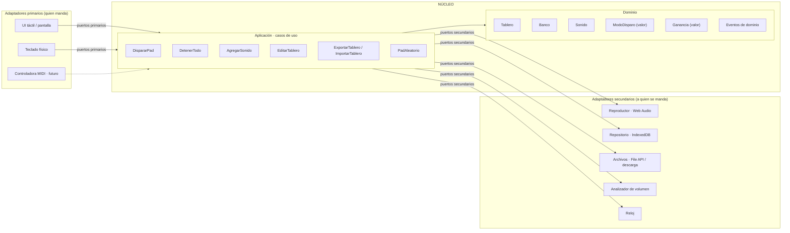

# Arquitectura hexagonal de la app (diseño propio, 2026-09-12)

Diseño desde cero, sin heredar nada de VirtualDJ. Objetivo: una consola de sonidos para fiestas (locutor/DJ) que corre en el navegador del celular, funciona sin señal y crece a mezclador sin rediseñarse. Reemplaza a la propuesta anterior ([ARQUITECTURA_NUESTRA_APP.md](ARQUITECTURA_NUESTRA_APP.md)), que queda como referencia comparativa.

## 1. Principio rector

El hexágono tiene un **núcleo** (dominio + casos de uso) que no sabe que existe un navegador, un archivo, una pantalla ni un parlante. Todo lo que entra o sale del núcleo pasa por **puertos** (interfaces que define el núcleo). Los **adaptadores** implementan esos puertos con tecnología concreta y viven afuera.

Regla de dependencias, sin excepciones:

```
adaptadores  ──►  aplicación (casos de uso)  ──►  dominio
     ▲                                              │
     └──────────── nadie apunta hacia afuera ◄──────┘
```

- `dominio/` no importa nada, ni siquiera de `aplicacion/`.
- `aplicacion/` importa solo `dominio/` y declara los puertos.
- `adaptadores/` importan `aplicacion/` y `dominio/`, nunca entre sí.
- `main.js` (raíz de composición) es el único lugar que conoce a todos y los conecta.

## 2. Mapa del hexágono



## 3. Dominio (el centro)

Modelo mínimo, con invariantes explícitas. Todo es inmutable: cada cambio devuelve una copia nueva.

### Entidades y agregados
- **Tablero** (agregado raíz): conjunto ordenado de *Bancos*, volumen maestro, versión del esquema.
  Invariantes: nombres de banco únicos; una tecla rápida no se repite en todo el tablero; un sonido pertenece a exactamente un slot.
- **Banco**: nombre, color, lista de *Slots* (posición → Sonido). Invariante: sin dos sonidos en el mismo slot.
- **Sonido**: `id`, `nombre`, `color`, `modo`, `ganancia`, `teclaRapida?`, `duracionMs`, `origen` (subido | fábrica | importado). No contiene el audio: el audio es un *blob* que vive en el repositorio y se referencia por `id`.

### Objetos de valor
- **ModoDisparo**: `UN_TIRO` (suena completo), `LOOP` (repite hasta volver a tocar), `MANTENER` (suena mientras se presiona), `EXCLUSIVO` (corta cualquier otro del mismo banco al sonar, para camas musicales).
- **Ganancia**: número en [0, 2], con `Ganancia.desdeMedicion(picoDb, rmsDb)` que calcula la corrección para nivelar sonidos.
- **TeclaRapida**: un carácter, normalizado a mayúscula.

### Eventos de dominio (lo que el núcleo publica)
`SonidoAgregado`, `SonidoEliminado`, `TableroCambiado`, `PadDisparado`, `ReproduccionDetenida`. Los adaptadores primarios se suscriben para redibujar; el núcleo no llama a la UI jamás.

### Servicios de dominio
- `SelectorAleatorio(banco, excluir?)`: elige un sonido distinto al último, para el pad ruleta.
- `ReglasDeSolapamiento(modo, estadoActual)`: decide si un disparo nuevo debe cortar algo (solo el modo `EXCLUSIVO` corta).

## 4. Puertos (contratos que define el núcleo)

### Primarios (driving): lo que la app ofrece hacia afuera
```js
// aplicacion/puertos/primarios.js
export class ConsolaAPI {           // fachada de todos los casos de uso
  dispararPad(bancoId, slot, opts)  // opts: { presionado: true|false } para MANTENER
  detenerTodo()
  agregarSonido(archivo, { bancoId, slot, nombre })
  editarSonido(soundId, cambios)    // nombre, color, modo, ganancia, teclaRapida
  moverSonido(soundId, { bancoId, slot })
  eliminarSonido(soundId)
  crearBanco(nombre) / renombrarBanco / eliminarBanco / reordenarBancos
  fijarVolumenMaestro(valor)
  padAleatorio(bancoId)
  exportarTablero() -> Blob
  importarTablero(blob, { reemplazar: bool })
  suscribir(evento, callback)       // a los eventos de dominio
  estado() -> Tablero               // lectura, para pintar
}
```

### Secundarios (driven): lo que el núcleo necesita del mundo
```js
// aplicacion/puertos/secundarios.js
export class RepositorioTablero {   // persistencia del agregado + blobs
  async cargar() -> Tablero | null
  async guardar(tablero)
  async guardarAudio(soundId, blob)
  async leerAudio(soundId) -> Blob
  async eliminarAudio(soundId)
}
export class Reproductor {          // producir sonido
  async preparar(soundId, blob)     // decodifica y deja listo en memoria
  disparar(soundId, { ganancia, loop }) -> tokenReproduccion
  detener(token, { fadeMs })
  detenerTodos({ fadeMs })
  fijarMaestro(valor)
  estaSonando(soundId) -> bool
}
export class AnalizadorAudio {      // medir para normalizar
  async medir(blob) -> { picoDb, rmsDb, duracionMs }
}
export class Empaquetador {         // export / import
  async empaquetar(tablero, audiosPorId) -> Blob
  async desempaquetar(blob) -> { tablero, audiosPorId }
}
export class Reloj { ahora() -> number }
```

Los puertos son clases con métodos que lanzan `NoImplementado`; los adaptadores las extienden. Así el núcleo se prueba con **dobles en memoria** (un `RepositorioEnMemoria`, un `ReproductorFalso` que solo registra llamadas).

## 5. Casos de uso (aplicación)

Cada caso de uso es una clase con un solo método `ejecutar(...)`, recibe los puertos por constructor y devuelve el resultado o lanza un error de dominio. Ejemplo del más importante:

```
DispararPad.ejecutar(bancoId, slot, { presionado })
  1. tablero = repo.cargar()  (cacheado en memoria por la fachada)
  2. sonido = tablero.sonidoEn(bancoId, slot)  → error si vacío
  3. decision = ReglasDeSolapamiento(sonido.modo, reproductor.estado)
  4. si decision.cortar: reproductor.detener(...)  con fade 30 ms
  5. si modo == MANTENER y !presionado: reproductor.detener(tokenDeEseSonido); fin
  6. token = reproductor.disparar(sonido.id, { ganancia: sonido.ganancia * maestro, loop: modo == LOOP })
  7. publicar PadDisparado(sonido.id, token)
```

`AgregarSonido` es el otro con lógica real: mide con `AnalizadorAudio`, calcula `Ganancia.desdeMedicion`, guarda blob y entidad, prepara en el reproductor, publica `SonidoAgregado`. Todo lo demás es CRUD sobre el agregado `Tablero`.

## 6. Adaptadores

### Primarios
- **UI táctil** (`adaptadores/ui/`): dibuja `estado()`, traduce toques a `dispararPad(..., {presionado})` (pointerdown/pointerup para MANTENER), abre diálogos de edición. Se suscribe a eventos para repintar. Vanilla JS + módulos ES, sin framework.
- **Teclado** (`adaptadores/teclado/`): mapa tecla → (bancoId, slot) derivado del tablero; `keydown`/`keyup`.
- **MIDI** (futuro, `adaptadores/midi/`): Web MIDI API; misma traducción, distinto origen. No requiere tocar el núcleo.

### Secundarios
- **ReproductorWebAudio**: un `AudioContext`, un `GainNode` maestro, un `GainNode` por disparo, `AudioBufferSourceNode` por token. `preparar()` decodifica una sola vez al cargar. Fades con `gain.linearRampToValueAtTime`.
- **RepositorioIndexedDB**: base `cabina`, stores `tablero` (un documento JSON) y `audios` (`id → Blob`). Transacciones por caso de uso.
- **AnalizadorOffline**: `OfflineAudioContext` para medir pico y RMS sin reproducir.
- **EmpaquetadorZip**: un `.zip` con `tablero.json` + `audios/<id>.<ext>` (librería ligera de zip inline o formato propio si se quiere cero dependencias).
- **RelojSistema**: `performance.now()`.

## 7. Raíz de composición (`main.js`)

```js
const repo   = new RepositorioIndexedDB('cabina');
const player = new ReproductorWebAudio();
const consola = new ConsolaAPI({ repo, player, analizador: new AnalizadorOffline(), empaquetador: new EmpaquetadorZip(), reloj: new RelojSistema() });
await consola.iniciar();                    // carga tablero, prepara audios en memoria
new UITactil(document.body, consola);
new AdaptadorTeclado(window, consola);
```
Es el único archivo que importa adaptadores y núcleo a la vez.

## 8. Estructura de carpetas

```
src/
  dominio/        Tablero.js Banco.js Sonido.js valores/ModoDisparo.js valores/Ganancia.js eventos.js errores.js servicios/
  aplicacion/     ConsolaAPI.js casosDeUso/*.js puertos/primarios.js puertos/secundarios.js
  adaptadores/    ui/ teclado/ audio/ almacenamiento/ empaquetado/ reloj/
  main.js
test/
  dominio/        pruebas puras (node --test)
  aplicacion/     casos de uso con dobles en memoria
  adaptadores/    pruebas de integración en navegador (pocas)
```

## 9. Estrategia de pruebas

| Capa | Herramienta | Qué se prueba | Sin navegador |
|---|---|---|---|
| Dominio | `node --test` | invariantes (slots/teclas duplicadas), Ganancia, reglas de solapamiento, selector aleatorio | sí |
| Aplicación | `node --test` + dobles | cada caso de uso: llamadas correctas a puertos, eventos publicados, errores | sí |
| Adaptadores | navegador real (manual + checklist) | Web Audio suena y solapa, IndexedDB persiste tras recargar, export/import round-trip, modo avión | no |

Meta: el 90% de la lógica se prueba en segundos desde la terminal.

## 10. Funcionamiento sin conexión

Nada en el núcleo depende de la red. Los adaptadores secundarios son locales (IndexedDB, Web Audio). El único requisito es que el navegador ya tenga cargado el HTML/JS: con la pestaña abierta, o con los archivos guardados en el teléfono y abiertos desde ahí. Si más adelante se quiere garantía total, un *service worker* es un adaptador de infraestructura más; no cambia ni un puerto.

## 11. Cómo crece a mezclador (V2/V3) sin romper el hexágono

- Nuevo agregado de dominio `Sesion` (cola de canciones, punto de mezcla) y casos de uso `CargarEnDeck`, `Mezclar`.
- Nuevo puerto secundario `ReproductorDeck` (play/pause/seek/tempo) implementado también con Web Audio.
- Nuevo puerto secundario `FuenteDeAnalisis` con un adaptador que lee `database.xml` de VirtualDJ para BPM/cues, y otro que analiza con Web Audio si no hay dato.
- La UI suma un panel; el tablero de pads ni se entera.

## 12. Decisiones pendientes (las mismas de antes)
Aspecto visual · sonidos de fábrica · categorías iniciales · nombre. Con eso, el paso 1 es escribir `dominio/` y `aplicacion/` con sus pruebas.
